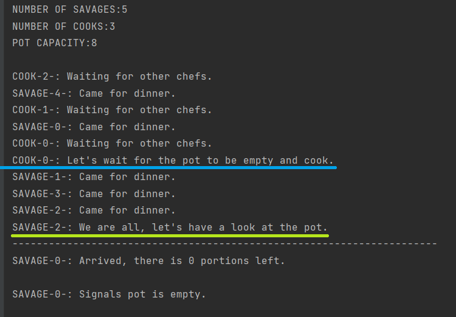
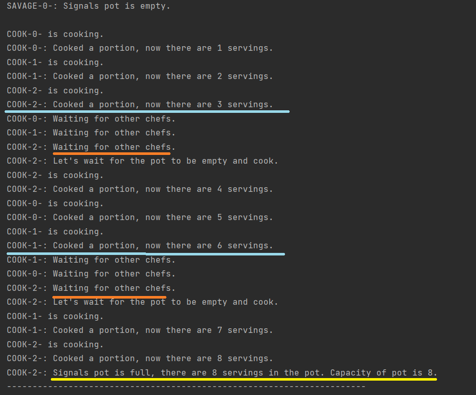
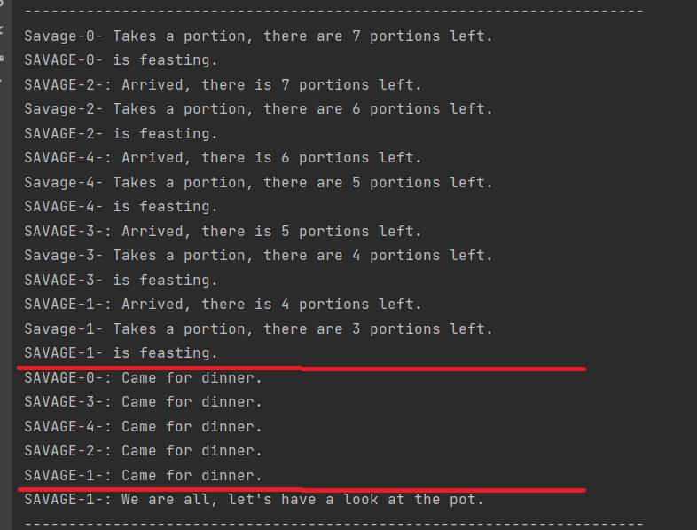
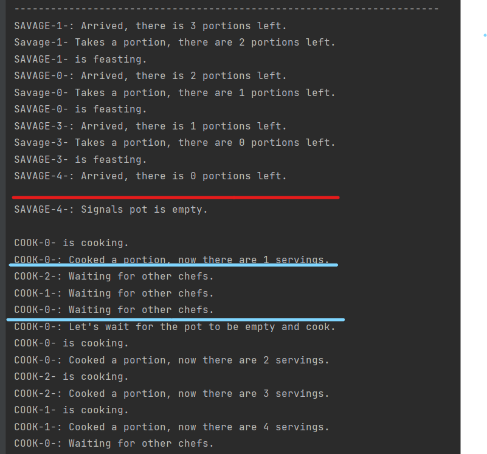

# BIG TASK: TASK 04 - IMPLEMENT FEASTING SAVAGES PROBLEM

## TASK SPECIFICATION:
1.  Implement solution for Feasting Savages problem with one or multiple cooks.
2.  Source code must:
   -  be compatible with Python 3.10

   -  contain module header with module description, author's name and licence
    
   -  be comprehensive and well documented
    
   -  each function (class and its methods) must have docstring in PEP 257
    
   -  PEP 8 
3.  Use multiple print functions to demonstrate correct functionality of your solution.
4.  Test your implementation.
  
5.  Write documentation. Documentation should contain all necessary details about the implementation.
  
6.  Explain usage of synchronisation mechanisms on examples from your code.
---
## TASK SOLUTION:
Source code contains implementation of a solution for the Feasting Savages problem with multiple chefs. The implementation can be found in file [feasting_savages.py](https://github.com/AlzbetaFekiacova/Fekiacova_105061_feippds/blob/04/feasting_savages.py)

To execute the program you need to have  `fei.ppds` module installed. It can be done via `pip install --user fei.ppds`. Source code contains `if __name__ == "__main__"` idiom, so the program will be executed when you run the file. When you run the file, 8 threads will be created. 5 threads represent the savages, the remaining three represent chefs. The treads execute their function in an infinite loop. Pot capacity is set to 8.

### What is the Feasting Savages problem?
The Feasting Savages problem is another example of synchronisation problem in which we need to solve problem of mutual exclusion of different types of processes during program execution.

#### Problem definition:
Savages in Equatorial Guinea are very social and advanced type of savages.
Not only do they always eat together every day, but they also have excellent
chefs who prepare delicious vegetarian stew. However, they need a
reliable system in which all their actions will be announced. The multiple rules they follow are:
   -   Savages always eat together. The one, who arrived last, signals them that they are all and that they can start to feast.
   -   Each of the savages takes his/her own portion until the pot is empty.
   -   The one savage, that notice that the pot is empty, notifies the chefs that new meal must be cooked.
   -   The savages wait for the chefs to finish cooking.
   -   Chefs:
     -   In case of multiple chefs, each chef always cook only one portion and puts it into the shared pot.
     -   In case of one chef, the chef cooks full pot.
   -   If the pot is full, the savages may start to feast again.
   -   The process is repeated in an endless cycle.


### Implementation
```python
class Shared:
    def __init__(self, servings):
        self.savages_mutex = Mutex()
        self.chefs_mutex = Mutex()
        self.pot_portions = servings

        self.full_pot = Event()
        self.empty_pot = Event()

        self.barrier_1_savages = SimpleBarrier(SAVAGES_COUNT)
        self.barrier_2_savages = SimpleBarrier(SAVAGES_COUNT)

        self.barrier_1_cooks = SimpleBarrier(CHEFS_COUNT)
        self.barrier_2_cooks = SimpleBarrier(CHEFS_COUNT)      
```
The class Shared has been created and used to represent multiple information needed to be shared between the savages and the chefs. In the code snippet, we see the constructor of the class. I will explain what each of the attribute is used for in few lines.

We need a variable to represent the shared pot. It is by variable pot_portions. At the program execution it is initialised to 0, as the chefs need to cook the meal first.

As savages and cooks modify the content of the pot, we need to guarantee the integrity of the number of portions. That is the reason why we weed two mutexes, one for the savages eating from the pot (decreasing the number of portions) and the other one for the chefs, who are putting portions to the pot(increasing the number of portions).

In the task definition, it was mentioned that the savages eat only when they are together. For such a behavior we need a barrier.

For the chefs, as I understood from the task assignment, their behaviour was not specified, but to make the implementation easier it was recommended to force such a behavior also for the chefs. That is the reason why there is also another barrier for the chefs.

The last thing we need is something for the signalisation. For the savages to notify the chefs, that the pot is empty and for the chefs to notify the savages that the pot is full, and they can feast.

#### Savage behaviour
In this section I will explain the function that represents behaviour of the savages. The snippet have been reduced by control prints to make the code shorter. The commentaries have been added for better explanation.

```python
    while True:
# the savages are waiting for each other
shared.barrier_1_savages.wait()
shared.barrier_2_savages.wait()
shared.savages_mutex.lock()  # integrity of the pot
if shared.pot_portions == 0:  # there is no more portions 
    shared.empty_pot.signal()  # signal to the chefs that the pot is empty
    shared.full_pot.clear()  # clear the event so it can be used again
    shared.full_pot.wait()  # wait for the pot to be full

shared.pot_portions -= 1  # take a portion 
shared.savages_mutex.unlock()  # integrity have been satisfied
eat(i)  # feast
```
In the behaviour of the savage we can see all the synchronisation mechanisms used in the implementation of the task.

##### Barrier
First of all, as was mentioned before, the savages eat only together. That is why we need a barrier. We need a reusable barrier as the code is executed in an endless loop. The barrier implementation I have used was introduced to us on third seminar of the subject PPDS by the lecturers.

The barrier is a synchronisation mechanism that is a basically a generalisation of rendezvous for multiple threads. It is used for multiple threads to wait for each other in order to execute their job. We used it in order for the savages to start to eat only when all of them have already eaten. Meaning, that for example, it cannot happen that if there would be 2 savages, only one of them would be eating. Always, both of them need to finish eating their portion in order to start eating again. If one of them have finished eating, he has to wait at the barrier for the other savage to finish eating, so both of them may together pass through the barrier.

The next synchronisation mechanism used is Mutex.

##### Mutex

The Mutex is locking mechanism used to synchronise access to critical section. In our problem, the critical section is modification of content of the pot, that is shared between the savages and the chefs. In order to check or modify the number of portions, we need to lock the mutex as we want only one savage at one time to access the pot.

As was described in the section before, about the class Shared, empty_pot and full_pot are Events. 

##### Event

Event is a synchronisation mechanism that is used to notify multiple waiting threads that something has happened, that some condition has become true. As in our implementation, we have multiple chefs, as well as multiple savages, we have used Event for signalisation pot state between them.  

In the code snippet we see, that first the savage checks whether there are any portions left. 

If the pot is empty, condition is satisfied, the savage signals to all the chefs that the pot is empty. Then the savage clears the full_pot event, so it may be later used by the chefs for signalisation. The savage then waits for the pot to be filled by chefs.

If the pot is not empty, the savage may take his/her portion and as he/she finished modifying the pot content, the mutex may be unlocked. 

The savage may then eat the portion he/she had taken from the pot before.

When the savage has fished eating, he/she then waits at the barrier for the remaining savages to finish eating as well.
#### Chef behaviour
Now we will focus on behaviour of a chef. As before, for the savage behaviour, I have removed the control prints to shorten the code and added the commentaries for better explanation.
```python
def cook(i: int, shared: Shared):
    while True:
        # the chefs are waiting for each other
        shared.barrier_1_cooks.wait()
        shared.barrier_2_cooks.wait()
        shared.chefs_mutex.lock() # integrity of the pot
        shared.empty_pot.wait() # wait for the pot to be empty
        if shared.pot_portions < PORTIONS_COUNT: # if the pot is not full
            shared.pot_portions += 1 # cook a portion
        if shared.pot_portions == PORTIONS_COUNT: # if pot is full
            shared.full_pot.signal() # signal to the savages that the pot is empty
            shared.empty_pot.clear() # clear the event so it can be used again
        shared.chefs_mutex.unlock() # integrity have been satisfied
```
In the code snippet, we see that the behaviour of a chef is quite similar to the behaviour of the savage, but chefs do not take from the pot, but produce food to the pot.

At first, the chefs wait for each other. 
This was not specified in the task assignment, however, if there was no barrier for the cooks, it happened to me quiet a lot, that only part of the chefs was cooking. As we wanted each chef to produce a portion, I have decided to use a barrier. 

When all the chefs gather around the pot, first thing that is needed is to lock the pot, so the integrity of the pot would not be violated.
Then they wait for the pot to be empty, as the savages need to finish up all the pot, before the chefs may start to cook again.

If there is still space, the chef may cook and put the portion in the pot.

If the pot is full, the chef signals to the savages, that the pot is full, and he also clears the event for empty pot, so it can be used later for signalisation by the savages.

At the end, we can unlock the mutex, as the integrity has been satisfied.

And again, as the savages, the chefs wait for each other at the barrier in order to wait together for signal of empty pot from the savages.

## Conclusion
We have implemented solution for Savages problem with multiple chefs. Savages eat only together, they wait for each other, the chefs cook only when the pot is empty, each chef cooks only one serving. Chefs and savages do not mix up, savages cannot eat while the chefs are cooking and chefs cannot cook when the savages are eating. 

In the code, we used multiple synchronization mechanisms, that have been described in section Savage Behaviour. I will present the code behaviour on screenshots from the code output.

On the top of the picture, we see that number of savages is 5, number of chefs is 3 and pot capacity is 8. At the beginning, the pot is empty.

At first, chefs and savages are assembling around the pot. The blue line represents meeting point of the chefs. COOK-0 signals, that they are all. The yellow line on the other hand, represents meeting point of the savages.
We see that after it was signalised, that all the savages are together, one of them is having a look at the pot. As the pot is empty, the savage who noticed signals it to the chefs.



The second screenshot shows cooking process of the chefs. Each of them put one portion to the pot. When all them have cooked, they wait for each other at the barrier. The orange line represent meeting point, where all them meets and the last chef signals to the remaining cooks that they are all and may cook again.
At the end, we see that chef cooked, put a portion to the pot, and made the pot full. The pot fullness is signaled to the savages.



On the picture above we see the feast itself. Each of the savages takes a portion and eat. The red lines represents barrier. The savages are coming to the barrier where they are waiting for each other. When the last savage arrives, he signals to others, they may have a look at the pot.


On the last picture we see that after the savages met, they started to immediately eat as the pot was not empty. When they finished the pot, they signaled it to the cooks. Then the cooks started to cook again. They will be cooking again until one of them would put the last portion. Then again the savages would start eating and so on until the end of time.
We can notice that once the cooks are putting portions into the pot, the savages do not eat and vice versa which is a correct behaviour.
## Sources
- [Seminar 2023-04](https://www.youtube.com/watch?v=54zi8qdBjdk&ab_channel=Mari%C3%A1n%C5%A0ebe%C5%88a)
- [Seminar 2022-05](https://www.youtube.com/watch?v=iotYZJzxKf4&ab_channel=Paraleln%C3%A9programovanieadistribuovan%C3%A9syst%C3%A9my)
- [GitHub of the course PPDS](https://github.com/tj314/ppds-2023-cvicenia)