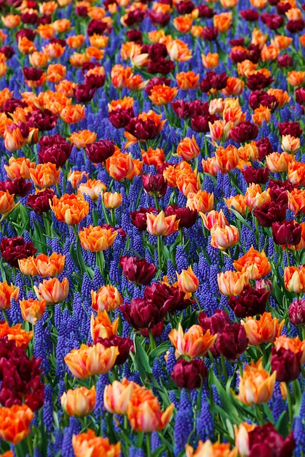
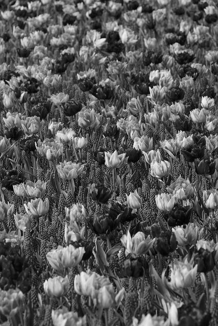
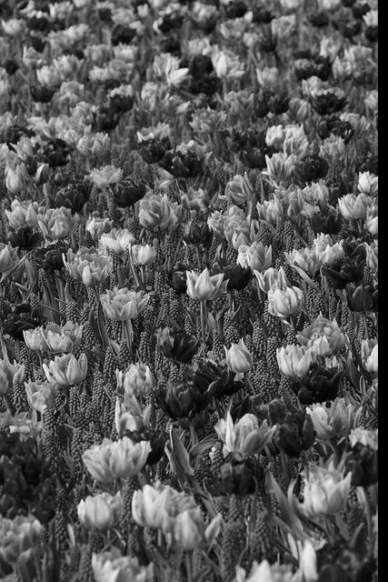
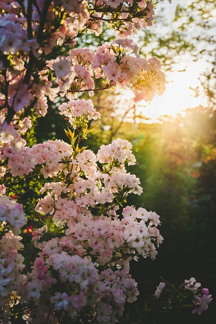
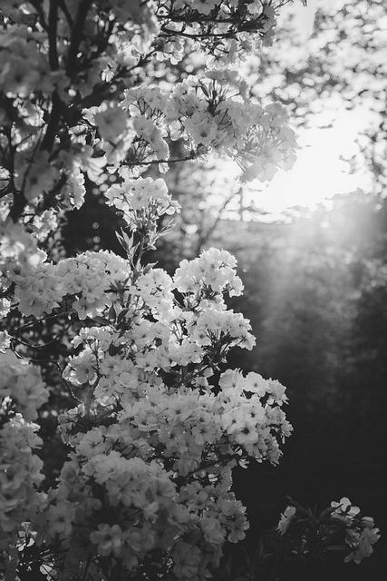
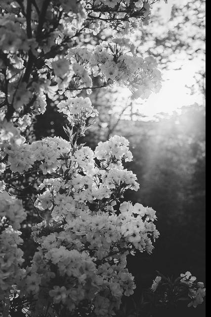
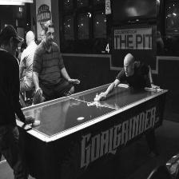
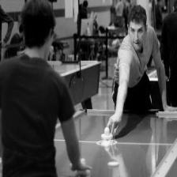

# TASK 05 - CUDA

## TASK SPECIFICATION:

1. Load image in jpg format, converts it to grayscale with
   using GPU and write to a new file.
2. Load image in jpg format, converts it to grayscale with
   using the CPU and write to a new file.
3. Convert a large number of images with both methods. Record it
   are the average conversion times.
4. Source code must:
    - be compatible with Python 3.10

    - contain module header with module description, author's name and licence

    - be comprehensive and well documented

    - each function (class and its methods) must have docstring in PEP 257

    - PEP 8
5. Write documentation. In the documentation, include information about the assignment, instructions for starting and
   CPU and GPU conversion comparison. Add
   several examples of converted images. Don't forget to mention what
   computation have been used for the conversion.

-------------------

## TASK SOLUTION:

Source code contains implementation of converting colour image to grayscale both on CPU and GPU. The implementation can
be found in file [cuda_task.py](https://github.com/AlzbetaFekiacova/Fekiacova_105061_feippds/blob/05/cuda_task.py).
Python version 3.10.x is necessary.
To execute the program you need to have multiple modules installed:

- `fei.ppds`module
- `numpy`module
- `matplotlib`module
- `matplotlib`module
- `numba`compiler

Installation can be done via `pip install` in the console or directly through PyCharm IDE through Python Packages.
Source code contains `if __name__ == "__main__"`idiom, so the program will be executed when you run the file.
When you run the code, first gray scaling of 20 test images on CPU is executed, then gray scaling on GPU is executed on
the same set of testing images. Converted images are stored into separate files.

### Implementation

#### Conversion functions

For gray scale conversion I have used specific formula, that is the same for execution both on CPU and GPU.

```python
def convert_image(image, x, y):
    r = image[x, y, 0]
    g = image[x, y, 1]
    b = image[x, y, 2]
    return 0.299 * r + 0.587 * g + 0.114 * b      
```

This function server to compute gray scaled value of a pixel on position x, y in the image.

Then I have defined 2 functions, `rgb_to_gray_cpu and rgb_to_gray_cuda`.

The function executed on CPU has one parameter, image. It executes two for loops to travers though all the pixels of the
input image and call the `convert_image` (explained above) on each of the image pixel.

The function executed on GPU has two parameters, the input_image and output_image as the function cannot return
anything. By calling cuda.grid(2) we are able to determine the current thread's position based on the grid and block
dimensions.
Then we can execute check whether the computed position is valid position in the image. If it is, `convert_image` (
explained above) can be called with the computed x and y positions and the output is saved to the output_image.

#### Conversion of one picture

I have defined 2 functions that performs conversion of one image, saves converted image and computes the time of the
conversion that is returned. The functions are defined as `cuda_func(image_path)` and `cpu_func(image_path)`.

Function executed on CPU is easy, we just need to open the image, start the timer, `rgb_to_gray_cpu` on image, end timer
and save the converted image.

Function executed on GPU is a little more complicated. Firstly, we need to open the image as on CPU. But then we need to
create empty image of the same size to be the output image. Then we need to transfer those images to device memory with
usage of `cuda.to_device(input_image), cuda.to_device(output_image)`.
Then we also need to define number of threads per block by `threads_per_block = (16, 16)`. It means that each block will
contain 16 threads horizontally and 16 threads vertically.
We also need to compute number of blocks per grid in both directions. It can be done simply via
division `dimension // threads_per_block_in_that_direction`
We can finally start the timer, then
call `rgb_to_gray_cuda[blocks_per_grid, threads_per_block](d_input_image, d_output_image)`, end timer and save the
converted image.

#### Code executed in a loop

Both of these functions `cuda_func(image_path)` and `cpu_func(image_path)` are executed in a loop over all the images in
separate functions `cpu_main` and `gpu_main.` They both return total sum of time conversion of all the images
took.

### TESTING

At first, I executed the conversion on bigger images. The conversion on emulator took a long time, so I have switched to
smaller images with size of 427x640. The images can be found
in [package flowers original](https://github.com/AlzbetaFekiacova/Fekiacova_105061_feippds/tree/05/images/original)
I have downloaded 20 images of flowers and the results can be found in:

- [package flowers converted CPU](https://github.com/AlzbetaFekiacova/Fekiacova_105061_feippds/tree/05/images/transformed_CPU)
- [package flowers converted GPU](https://github.com/AlzbetaFekiacova/Fekiacova_105061_feippds/tree/05/images/transformed_GPU)

``Average conversion of 20 images on CPU took -0.4439749399898574 time.-``

``Average conversion of 20 images on GPU took -19.09008324999828 time.-``

Original 

CPU transformation


GPU transformation


Original 

CPU transformation


GPU transformation


Then I wanted to download more images of flowers, but I got sick s,o I executed the next test on 100 sports image
database we got on
SUNS. The images have size of 224x224, they can be found
in [package sports original](https://github.com/AlzbetaFekiacova/Fekiacova_105061_feippds/tree/05/images/copied)

Transformed images can be found in

- [package sports converted CPU](https://github.com/AlzbetaFekiacova/Fekiacova_105061_feippds/tree/05/images/sports_transformed_CPU)

- [package sports converted GPU](https://github.com/AlzbetaFekiacova/Fekiacova_105061_feippds/tree/05/images/sports_transformed_GPU)

Original 

CPU transformation


GPU transformation


Original 

CPU transformation


GPU transformation


Original 

CPU transformation


GPU transformation


``Average conversion of 100 images on CPU took -0.48459530202206225- time.``

``Average conversion of 100 images on GPU took -18.525209265998566- time.``

### Conclusion

I have successfully implemented conversion of coloured image to grayscale both on CPU and GPU. I have tested my code on
more than 100 images of different sizes. The GPU conversion overall took longer, but it was due to emulator. 

-----------------------

## Sources

[Images source](https://pixabay.com/)

SUNS 2022 - TASK 3

Seminar 2.5.2023

Seminar 9.5.2023

[Image conversion](https://www.had2know.org/technology/rgb-to-gray-scale-converter.html)
