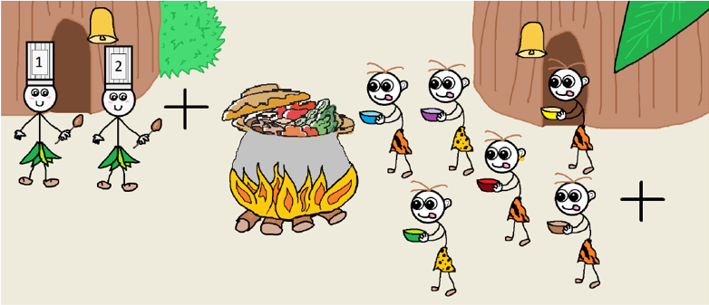

# BIG TASK: TASK 04 - IMPLEMENT FEASTING SAVAGES PROBLEM

## TASK SPECIFICATION:
1.  Implement solution for Feasting Savages problem with one or multiple cooks.
2.  Source code must:
   -  be compatible with Python 3.10

   -  contain module header with module description, author's name and licence
    
   -  be comprehensive and well documented
    
   -  each function (class and its methods) must have docstring in PEP 257
    
   -  PEP 8 
3.  Use multiple print functions to demonstrate correct functionality of your solution.
4.  Test your implementation.
  
5.  Write documentation. Documentation should contain all necessary details about the implementation.
  
6.  Explain usage of synchronisation mechanisms on examples from your code.
---
## TASK SOLUTION:
Source code contains implementation of a solution for the Feasting Savages problem with multiple chefs. The implementation can be found in file [feasting_savages.py](https://github.com/AlzbetaFekiacova/Fekiacova_105061_feippds/blob/04/feasting_savages.py)

To execute the program you need to have  `fei.ppds` module installed. It can be done via `pip install --user fei.ppds`. Source code contains `if __name__ == "__main__"` idiom, so the program will be executed when you run the file. When you run the file, 8 threads will be created. 5 threads represent the savages, the remaining three represent chefs. The treads execute their function in an infinite loop.

### What is the Feasting Savages problem?
The Feasting Savages problem is another example of synchronisation problem in which we need to solve problem of mutual exclusion of different types of processes during program execution.

#### Problem definition:
Savages in Equatorial Guinea are very social and advanced type of savages.
Not only do they always eat together every day, but they also have excellent
chefs who prepare delicious vegetarian stew. However, they need a
reliable system in which all their actions will be announced. The multiple rules they follow are:
   -   Savages always eat together. The one, who arrived last, signals them that they are all and that they can start to feast.
   -   Each of the savages takes his/her own portion until the pot is empty.
   -   The one savage, that notice that the pot is empty, notifies the chefs that new meal must be cooked.
   -   The savages wait for the chefs to finish cooking.
   -   Chefs:
     -   In case of multiple chefs, each chef always cook only one portion and puts it into the shared pot.
     -   In case of one chef, the chef cooks full pot.
   -   If the pot is full, the savages may start to feast again.
   -   The process is repeated in an endless cycle.

