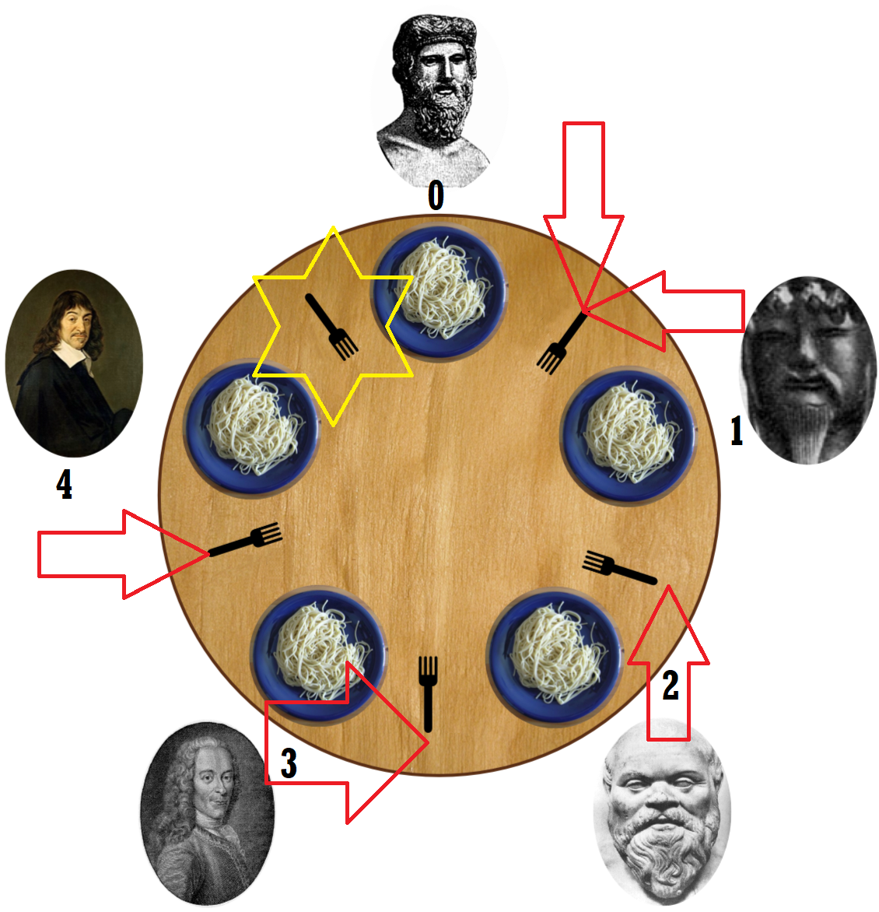
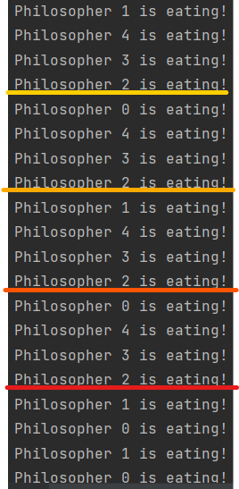

# TASK 03 - IMPLEMENT DINING PHILOSOPHERS PROBLEM

## TASK SPECIFICATION:
1. Implement solution of Dining Philosophers problem by:
   - A) usage of right-handed and left-handed philosophers
   - B) usage of token being passed after finish of eating to a neighbour
2. Source code must:   
   -  be compatible with Python 3.10
    
   - contain module header with module description, author's name and licence
    
   - be comprehensive and well documented
    
   - each function (class and its methods) must have docstring in PEP 257
    
   - PEP 8
    
3. Test your implementation.
  
4. Write documentation. Documentation should contain all necessary details about the implementation.
  
5. Explain difference between your implementation and solution with a waiter.
  

---

## TASK SOLUTION:

Source code contains implementation of a solution for the Dining Philosophers problem with usage of left-handed philosopher. The implementation can be found in file [philosophers.py](https://github.com/AlzbetaFekiacova/Fekiacova_105061_feippds/blob/03/philosphers.py)

To execute the program you need to have  `fei.ppds` module installed. It can be done via `pip install --user fei.ppds`. Source code contains `if __name__ == "__main__"` idiom, so the program will be executed when you run the file. When you run the file, 5 threads will be created. One thread represents left-handed philosopher and others the right-handed ones. The treads execute their function in a loop. Default number of runs is set to 10.

### What is the Dining Philosophers problem?

Dining Philosophers problem was introduced by Dijkstra in 1965 to illustrate the challenges of avoiding deadlock.  
Hoare modified the problem to form that we know today and that is object of our task. The problem is based on following:

- 5 philosophers are sitting around a round table
- each philosopher has his own place
- each philosopher has his own plate
- between each plate is a fork
- meal must be eaten with two forks
- each philosopher may only alternate between eating or thinking

On the picture above, we see that there is not enough of the forks for each of them to eat.

The object of the problem is how to design a concurrent algorithm such that no philosopher would starve and each of the philosophers may alternate between eating and thinking forever.

### Implementation
```python
from fei.ppds import Mutex  

NUM_PHILOSOPHERS: int = 5  

class Shared:  
   def __init__(self):       
       self.forks = [Mutex() for _ in range(NUM_PHILOSOPHERS)]  
```

The class Shared represents shared forks between the philosophers. Each fork is represented by a Mutex (Binary semaphore).  
If a fork is unlocked, it means it is free to be taken by a philosopher. If a fork is locked, it means that the fork has already been taken by someone.

Actions eat (defined on line 34) and think (defined on line 25) represent the two actions that philosophers alternate between. The functions contain a print that includes the philosopher's id and the type of action. The functions also include a sleep call, so the function takes a bit longer, or so that the philosopher's thread may be replaned while the function is being executed.

Now we need a function to represent a philosopher's behaviour. The first idea might look like this:

```python
    def philosopher(i: int):        
        think(i)  
        shared.forks[i].lock()        
        sleep(0.5)        
        shared.forks[(i+1) % NUM_PHILOSOPHERS].lock()        
        eat(i)        
        shared.forks[i].unlock()        
        shared.forks[(i + 1) % NUM_PHILOSOPHERS].unlock()  
```

At first glance we might not see a problem, however there is one.


On the image we see that each philosopher takes a fork (lock corresponding mutex) and his neighbour must wait for the philosopher to put the fork down (unlock the corresponding mutex) so he would be able to eat. But the philosopher would not put the fork down unless he finished eating. But the philosopher is able to eat only with two forks. We see that the no philosopher may continue with the execution. Each philosopher is stuck with one fork in the right hand unable to eat, meaning they would all starve and eventually die. This state is called deadlock. 
There are multiple ways how to solve this problem of a deadlock.  
On a seminar we have been presented a solution using a waiter.

### Waiter solution

Waiter is someone, who gives seats to the philosophers. The waiter can give chair only to 4 (NUM_PHILOSOPHERS - 1) philosophers at one time. The philosophers compete to get seated.  
To implement a waiter solution, we need to slightly modify both class shared and philosopher's function. We can represent the waiter by a Semaphore(NUM_PHILOSOPHERS - 1) that would be another attribute in the class Shared. Then before the philosopher takes the first fork, we need to make the philosopher to wait for the waiter to give him a seat. After the philosopher has finished eating, he signals it to the waiter.  
The source code from seminar can be found in file [philosophers_waiter.py](https://github.com/AlzbetaFekiacova/Fekiacova_105061_feippds/blob/03/philosophers_waiter.py)  

On the image we see that if there is a guarantee that only 4 philosophers may be seated at one time at the table, at least one philosopher would eat.

### Left-handed philosopher solution

Our task was to implement another type of the solution. I have decided for the left-handed philosopher solution.  
The idea behind the solution is that one philosopher is left-handed, meaning he starts to take the forks from the left.  
For this solution we do not need to modify the class Shared, the solution relies only on the mutexes representing the forks.  
What we need to modify is the philosopher's function.

```python
    def philosopher(i: int):       
        think(i)  
        if i == 0:            
            shared.forks[(i + 1) % NUM_PHILOSOPHERS].lock()            
            sleep(0.5)            
            shared.forks[i].lock()        
        else:            
            shared.forks[i].lock()            
            sleep(0.5)            
            shared.forks[(i+1) % NUM_PHILOSOPHERS].lock()        
        eat(i)        
        shared.forks[i].unlock()        
        shared.forks[(i + 1) % NUM_PHILOSOPHERS].unlock()
```

I have decided that the first philosopher is left-handed. That is why after the philosopher has finished thinking and want to eat, we check whether it is the first, left-handed, philosopher. The philosopher first takes the left fork and then the right one. Others take the forks in other direction.

  
On the picture we see that by making one philosopher left-handed, one fork stays free for the first and last philosopher to compete over. Meaning that as in the solution with waiter, we have guaranteed that always at least one philosopher would eat.

### Differences between the two implementations
In the solution with a waiter we need to add one more Semaphore to be shared between all the philosophers. All 5 philosophers complete to get seated and then only 4 philosophers wait for their free forks.  
The problem in this solution might be that the waiter would not give the seats fairly. It may happen that some philosophers would eat more frequently that the others and eventually starve. But it all depends on the planner and as we cannot predict how the planner will choose eating order of the philosophers, so we cannot guarantee 100% correctness of this solution.

In the solution with a left-handed philosopher, we do not need any extra Semaphore. All 5 philosophers wait for their forks to be free, so they can eat.  
As was described earlier, and also showed on a picture, two philosophers (0 and 1) take compete in order to take the fork first. That's why the order of philosophers eating is permutation of (1, 2, 3, 4) alternating with permutation of (0,2,3,4). One time left-handed philosopher wins, next time, right-handed philosopher wins. At the end only philosopher 0 and 1 alternate to eat up all the portions that they did not have.




On the picture above we see output of eating only. We can notice 4 alternations of the permutations and the last 4 lines belong to philosopher 0 and philosopher 1 who are switching places, as they have not eaten as much as others.  
All the philosophers eventually eat, and their order is not dependent on waiter, so we might consider this solution a slightly better one.

## Sources
- [Image source](https://commons.wikimedia.org/w/index.php?curid=56559)
- Seminar 2023 - 04
- [Seminar 2022 - 03](https://www.youtube.com/watch?v=DgI8E_bVfBA&ab_channel=Paraleln%C3%A9programovanieadistribuovan%C3%A9syst%C3%A9my) 