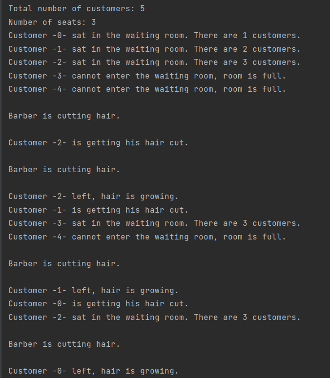

# TASK 02 - IMPLEMENT BARBER PROBLEM

## TASK SPECIFICATION:

1. Implement Barber problem with overrunning. Source code must:   
  
   -  be compatible with Python 3.10

   - contain module header with module description, author's name and licence
    
   - be comprehensive and well documented
    
   - each function (class and its methods) must have docstring in PEP 257
    
   - PEP 8
2. Test your implementation.
3. Write documentation. Documentation should contain all necessary details about the implementation. Example of your program input must also be part of it.
4. In your final solution, set number of customers to 5 and number of waiting seats to 3.
---
## TASK SOLUTION:

Source code contains implementation of Barber problem with outrun. The implementation can be found in file [barber_shop.py](https://github.com/AlzbetaFekiacova/Fekiacova_105061_feippds/blob/02/barber_shop.py)

To execute the program you need to have  using `fei.ppds` module installed. It can be done via `pip install --user fei.ppds`. Source code contains `if __name__ == "__main__"` idiom, so the program will be executed when you run the file. When you run the file, n number of threads will be created. 1 represents the barber and the remaing n - 1 represent customers (currently 5). Both barber and the customers perform their functions in an infinite loop.

### What is Barber problem?
Barber problem is a synchronisation problem introduced by Edsger Dijkstra in 1965. 
The problem is based on a barber shop with following characteristics:
   -  barber shop has two rooms:
      - waiting room for N clients
      - barber's room
   - if there is no client waiting, barber sleeps
   - if clients enters:
      - and all the seats in the waiting room are taken, the client leaves
      - if barber is cutting hair, but there is a free seat in the waiting room, the client sits and waits to have his hair done
      - if the barber is sleeping, the client wakes him up, take a seat and wait for the barber to wake up and cut his hair

The main task is to handle the coordination between the barber and the customers.

### Implementation

```python
from fei.ppds import Semaphore, Mutex


class Shared(object):
    def __init__(self):
        self.mutex = Mutex()
        self.waiting_room = 0
        self.customer = Semaphore(0)
        self.barber = Semaphore(0)
        self.customer_done = Semaphore(0)
        self.barber_done = Semaphore(0)
```

The class shared represents a barber shop. In the code above, we see the constructor of the class. It has 6 attributes to represent all the necessary information about the barber shop.

- attribute mutex (Binary Semaphore = Mutex):
  
  - protects integrity of counter
    
- attribute waiting_room (int):
  
  - counter
    
  - it represents number of how many people are already in the barber shop
    
  - it can have values from 0 to N (number of seats in the shop)
    
- attribute customer (Semaphore):
  
  - represent customer
    
  - customer sits in the waiting room (if there is a seat) and waits until the barber calls him
    
- attribute barber (Semaphore):
  
  - represents barber
    
  - barber waits for the customer come, or he sleeps
    
- attribute customer_done (Semaphore):
  
  - after the haircut is done, it signalises the barber that he is content with the haircut, finished and waits for the barber to finish (e.g. clean the room)
    
- attribute barber_done (Semaphore):
  
  - after the barber finishes cutting hair, semaphore signals to customer that the barber has finished and waits for the customer to finish (e.g. takes his stuff) and leave

This class provides us everything we need for implementation. All we need is to implement behaviour of the barber and the customers. 
#### Customer

```
customer():
    mutex.lock()

    if waiting_room == N:
        mutex.unlock()
        balk()
    else:
        waitng_room += 1
        mutex.unlock()

        customer.signal()
        barber.wait()
    
        get_haircut()
    
        customer_done.signal()
        barber_done.wait()

        mutex.lock()
        waiting_room -= 1
        mutex.unlock()
    
```
Barber
```
barber():
    customer.wait()
    barber.signal()

    cut_hair()

    customer_done.wait()
    barber_done.signal()
```
The first pseudocode above represents behaviour of a customer, the second one represents behaviour of a barber. In our solution the customers may outrun each-other. The order of getting a haircut does not depend on the order of taking seats in the waiting room. 

As always, we need to protect the integrity of the counter. Entering the barber shop or leaving it, changes the number of available seats. That is why there is a necessity to lock the mutex before accessing and modifying the number of waiting the customers.  
If customer wants to sit in the Barber shop, he has to check whether there is any seat left. If there is none, the customer leaves and wait some time before he checks it again. This behaviour is represented by function balk().  
If there is a seat left, the customer sits and gives a signal that he is there and is waiting for the barber.  

Then comes rendezvous 1 or mutual signalisation. On customer side, he signals the barber that customer is here and waiting for the barber to call him. On barber's side. The barber is waiting for the customer and signaling him that he is free to take care of his hair.  
After the first rendezvous happens, the action of cutting hair and getting hair cut can happen.  
After the hair is cut, another rendezvous must happen.  

The customer signals the barber that he is content with his hairstyle and waits for barber to finish. Barber, on the other hand, is waiting for the customer to finish and signaling that he is done with cutting the hair.  
After the second rendezvous is successful, the customer may leave.  

He again needs to lock the mutex, so the integrity of the counter stays protected. Leave the room, reduce the counter by one and of course, unlock the mutex again.

---

### Conclusion
To demonstrate how the implementation works, I will explain the output of the code.

On the picture above, we see that the total number of customers is 5 and number of seats in the barber shop is 3. It means that there can only be 3 customers in the barber shop, there are only 3 seats. One for the one whose hair is going to get cut (or now being cut) and the remaining two for those who are waiting. 

Customers 0, 1, 2 can enter the room and take a seat and signal to the barber, that they need a haircut. 
Customers 3 and 4 cannot enter the shop, as all the seats have already been taken.

The barber woke up and started to cut hair of customer 2.

We can see that after the barber finished cutting customer 2 hair, he  immediately started to cut hair of another customer (customer 1), but the message that customer 2 has left and is hair is growing again comes after the barber started to cut someone else's hair.
It is because we cannot predict how the planner plans and interrupts the processes. 

In the code, the barber waited for the customer 2 to finish and then signaled him that he has finished cutting hair.  
Customer 2 signaled barber that he is finished and waited for the barber to finish.
After they both finished, the planner interrupted the customer 2, but customer 2 has still not left the barber shop (e.g. taking his coat from the waiting room), but the barber was free to take care of customer 1 hair. 
That is why we see the message Barber is cutting hair before the message Customer -2- left, hair is growing.

Then the customer 1 is getting his hair cut.

As the customer 2 has left, there is a free seat and customer 3 can sit.
Customer 4 however, cannot, as again, all the seats have been taken.

Again, same as before, the signalisation and waiting between the barber and customer 1 has happened and the barber started to cut hair of customer 0.
Customer 1 left, freeing the seat for customer 2 whose hair has already grown.

- We see that only 3 customers can be in the barber shop at one time. 
- We see that there are more customer coming to the barber shop, that there are available seats.
- At the begging of the execution, the barber sleeps.
- After there is at least one customer the barber wakes up.
- The barber can cut hair of only one customer.
- The customers may overrun, the order of their hair getting cut is not dependent on the order how they have taken their seats.

We have implemented the Barber shop following all the rules mentioned in the problem definition.


---
## Sources:
- [Lecture 2022-02](https://www.youtube.com/watch?v=sR5RWW1uj5g&ab_channel=Paraleln%C3%A9programovanieadistribuovan%C3%A9syst%C3%A9my)
  
- [Seminar 2021-06](https://www.youtube.com/watch?v=IOeO6RDhhac&ab_channel=Paraleln%C3%A9programovanieadistribuovan%C3%A9syst%C3%A9my)
  
- [Seminar 2023-03](https://elearn.elf.stuba.sk/moodle/pluginfile.php/75802/mod_resource/content/1/PPDS_cv3.pdf)
  
- [A simple guide to The Sleeping Barber Problem](https://www.youtube.com/watch?v=cArBsUK1ufQ&ab_channel=EliTadeo)